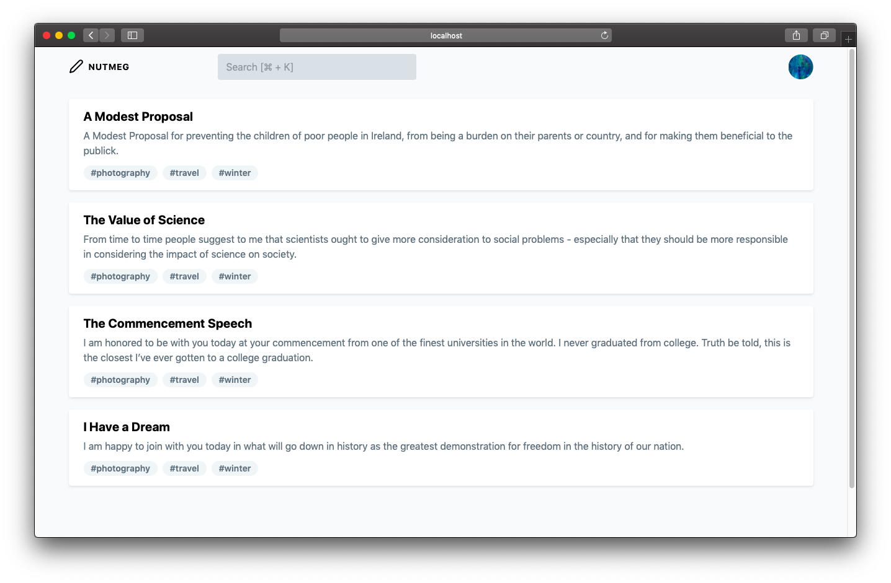
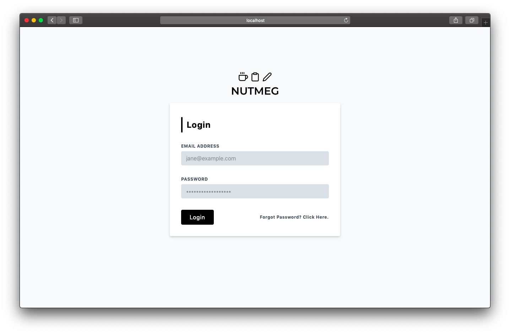

    

<h3 align="center">A dead simple note taking app built for the web.</h3>
<h4 align="center">Work in Progress.</h4>

## Features
- Markdown Shortcuts

## Technology Stack
- VueJS
- ExpressJS
- Sqlite

## Try the app
**NOTE: The app is still a work in progress, this means it's a wreck at the moment.**
1. Clone the app `git clone https://github.com/scmmishra/nutmeg.git`
2. `cd` into the repository, you shall find two folders `client` and `server`.
3. `cd` into each directory and run `yarn` or `npm install` whatever makes you roll.
4. Run `yarn start` on one terminal.
5. Run `yarn serve` on another terminal

## Screenshots

## License
GNU General Public License v3.0